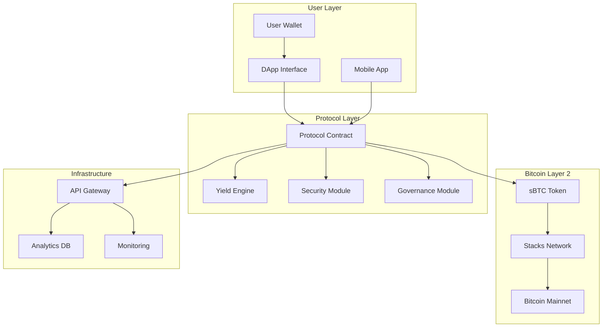
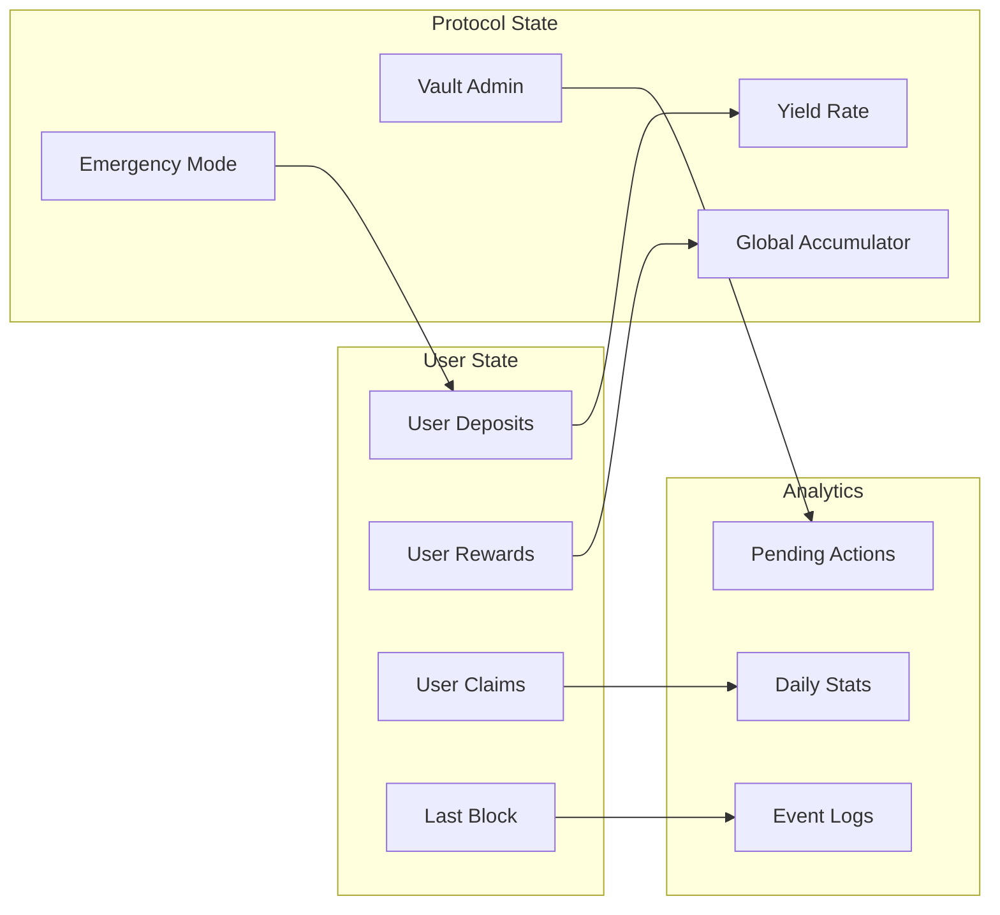
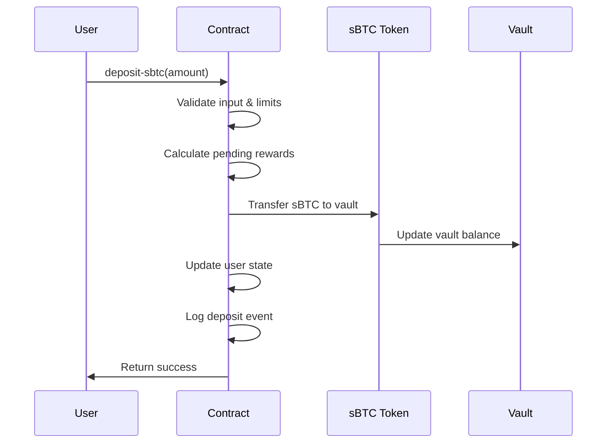
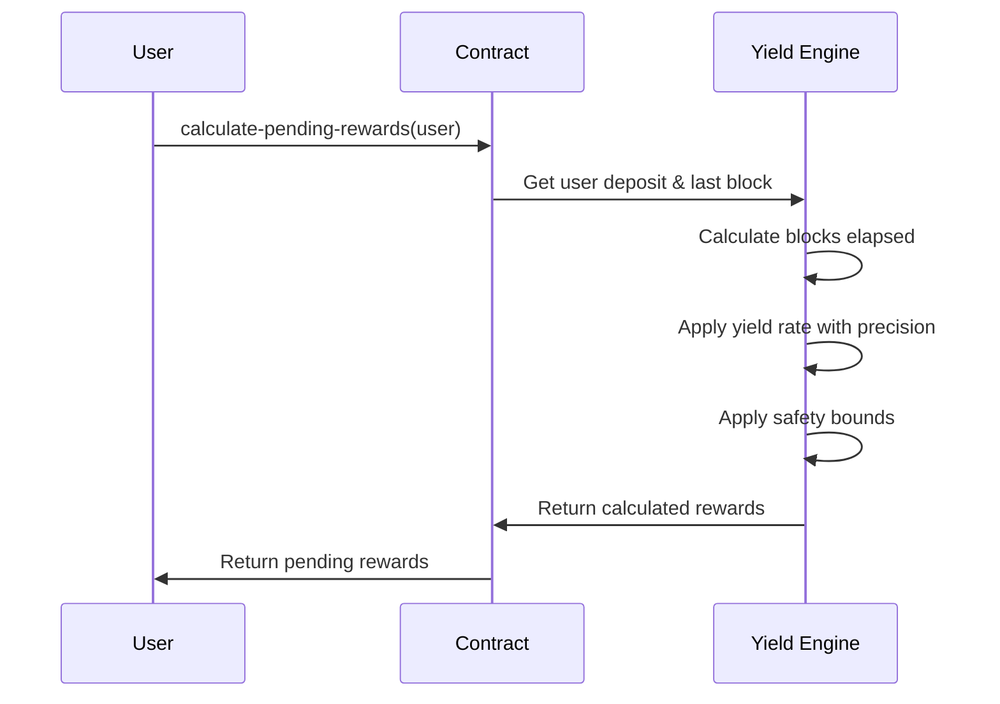
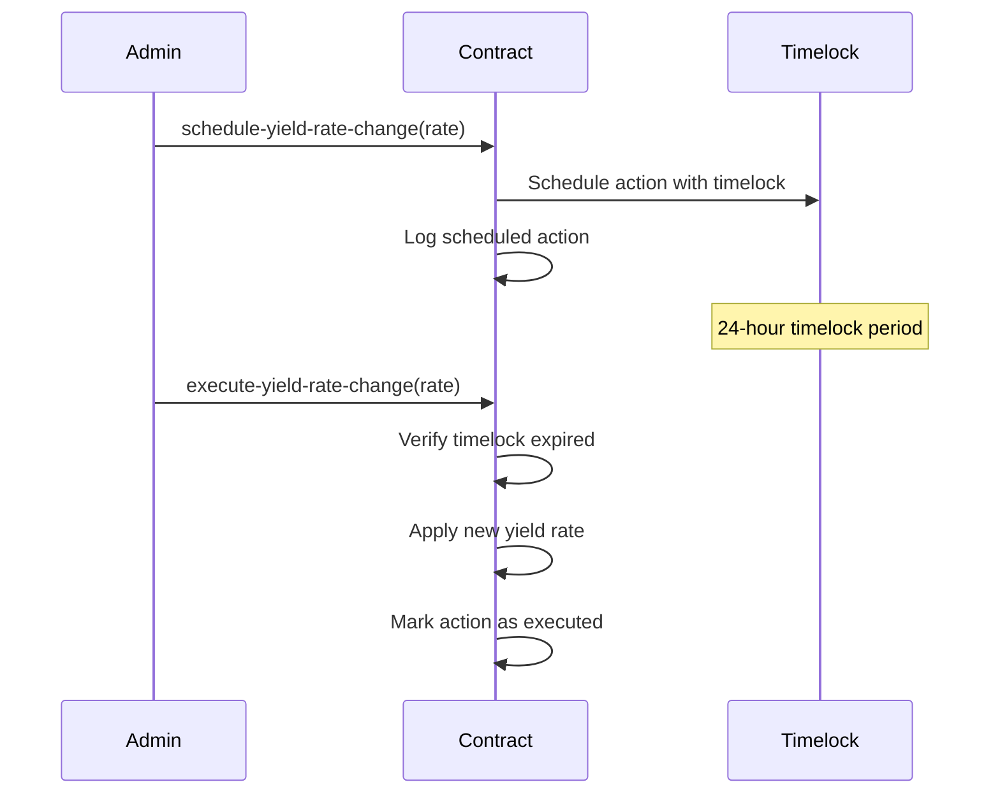

# BitStack Yield Vault Protocol


[](https://stacks.co)
[](https://bitcoin.org)
[](LICENSE)

## Enterprise-Grade sBTC Yield Generation on Bitcoin Layer 2

### Revolutionizing Bitcoin DeFi with institutional-level security and precision yield distribution

## 🚀 Overview

BitStack Yield Vault is a cutting-edge DeFi protocol built on Stacks Layer 2 that enables users to earn competitive yields on their sBTC holdings. Designed with enterprise-grade security and institutional-level features, the protocol bridges traditional finance expectations with Bitcoin's revolutionary potential.

### Key Features

- **🔒 Enterprise Security**: Multi-layer security with emergency controls and timelock mechanisms
- **⚡ Real-time Rewards**: Continuous yield accrual with precision-engineered algorithms
- **🛡️ Risk Management**: Comprehensive deposit limits and whale protection
- **📊 Transparent Governance**: Timelock-protected administrative functions
- **🔄 Emergency Recovery**: Circuit breaker mechanisms for crisis response
- **📈 Advanced Analytics**: Real-time protocol metrics and user dashboards

## 🏗️ System Architecture

### High-Level Architecture



### Core Components

| Component | Purpose | Technology |
|-----------|---------|------------|
| **Yield Engine** | Calculates and distributes rewards | Clarity Smart Contract |
| **Security Module** | Emergency controls & risk management | Multi-signature + Timelock |
| **Governance Module** | Protocol parameter management | DAO-compatible framework |
| **sBTC Integration** | Bitcoin-backed token operations | Stacks Layer 2 |

## 🔧 Contract Architecture

### State Management



### Security Layers

1. **Input Validation**: Comprehensive parameter checking
2. **State Guards**: Protocol pause and emergency modes
3. **Economic Limits**: Deposit caps and yield rate bounds
4. **Timelock Governance**: 24-hour delay for critical changes
5. **Atomic Operations**: Check-Effects-Interactions pattern
6. **Emergency Recovery**: Circuit breaker for crisis response

## 📊 Data Flow

### Deposit Flow



### Yield Calculation Flow



### Governance Flow



## 🛠️ Technical Specifications

### Protocol Parameters

| Parameter | Value | Description |
|-----------|-------|-------------|
| **Minimum Deposit** | 0.01 sBTC | Minimum viable deposit amount |
| **Maximum Deposit** | 1,000 sBTC | Individual user deposit ceiling |
| **Maximum Yield Rate** | 10% APY | Risk management ceiling |
| **Timelock Period** | 24 hours | Governance action delay |
| **Precision Factor** | 100,000 | Mathematical precision multiplier |

### Error Codes

| Code | Constant | Description |
|------|----------|-------------|
| `u100` | `ERR_NOT_OWNER` | Unauthorized ownership operation |
| `u101` | `ERR_INSUFFICIENT_BALANCE` | Insufficient user balance |
| `u102` | `ERR_INSUFFICIENT_VAULT_FUNDS` | Vault liquidity shortage |
| `u103` | `ERR_UNAUTHORIZED` | Unauthorized access attempt |
| `u110` | `ERR_EMERGENCY_MODE_ACTIVE` | Protocol in emergency state |
| `u111` | `ERR_TIMELOCK_NOT_EXPIRED` | Governance timelock active |

## 🚀 Quick Start

### Prerequisites

- Stacks wallet (Xverse, or compatible)
- sBTC tokens for deposits
- Stacks testnet/mainnet access

### Basic Operations

```javascript
// Deposit sBTC
await contractCall({
  contractAddress: 'SP...',
  contractName: 'bitstack-yield-vault',
  functionName: 'deposit-sbtc',
  functionArgs: [uintCV(1000000)], // 0.01 sBTC
});

// Check user position
const position = await callReadOnlyFunction({
  contractAddress: 'SP...',
  contractName: 'bitstack-yield-vault',
  functionName: 'get-user-position',
  functionArgs: [principalCV(userAddress)],
});

// Claim rewards
await contractCall({
  contractAddress: 'SP...',
  contractName: 'bitstack-yield-vault',
  functionName: 'claim-rewards',
  functionArgs: [],
});
```

## 📈 Protocol Metrics

### Real-time Dashboards

- **Total Value Locked (TVL)**: Live sBTC deposits
- **Active Users**: Unique depositors
- **Yield Distributed**: Total rewards claimed
- **Average APY**: Effective annual percentage yield
- **Vault Health**: Liquidity and utilization metrics

### Analytics Features

- Daily protocol statistics
- User position tracking
- Reward distribution history
- Emergency event monitoring
- Governance action logs

## 🔐 Security Considerations

### Audit Status

- **Smart Contract Audit**: Pending professional audit
- **Security Review**: Internal security assessment completed
- **Bug Bounty**: Community-driven security testing

### Risk Factors

- **Smart Contract Risk**: Potential bugs in contract logic
- **Liquidity Risk**: Vault funding dependency
- **Governance Risk**: Administrative key management
- **Market Risk**: sBTC price volatility
- **Layer 2 Risk**: Stacks network dependency

## 🤝 Contributing

We welcome contributions from the Bitcoin and Stacks communities:

1. **Bug Reports**: Submit issues via GitHub
2. **Feature Requests**: Propose enhancements
3. **Code Contributions**: Submit pull requests
4. **Documentation**: Improve guides and documentation
5. **Testing**: Help with testnet validation
